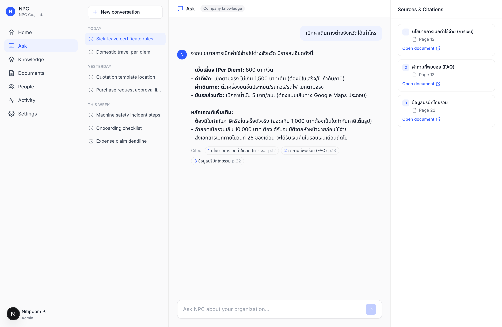
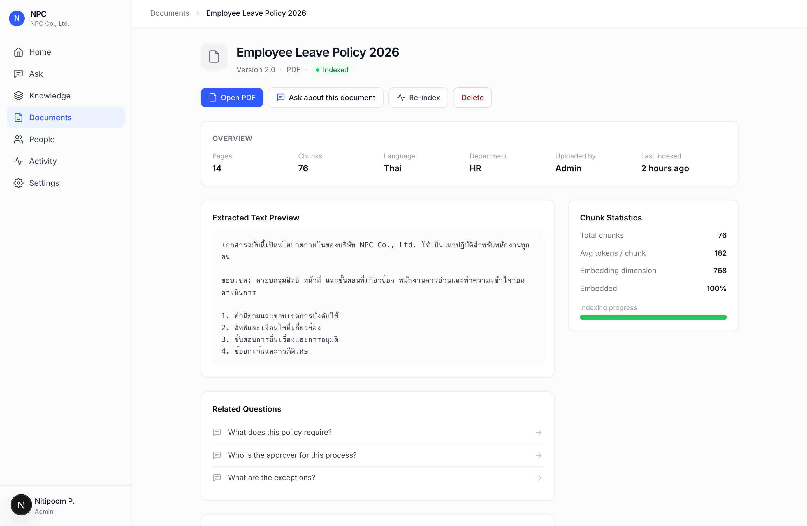
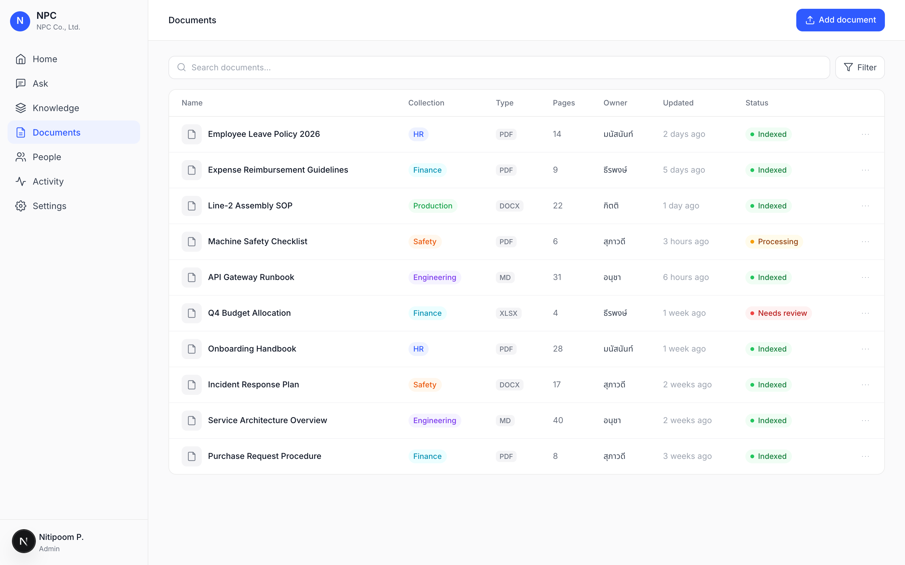
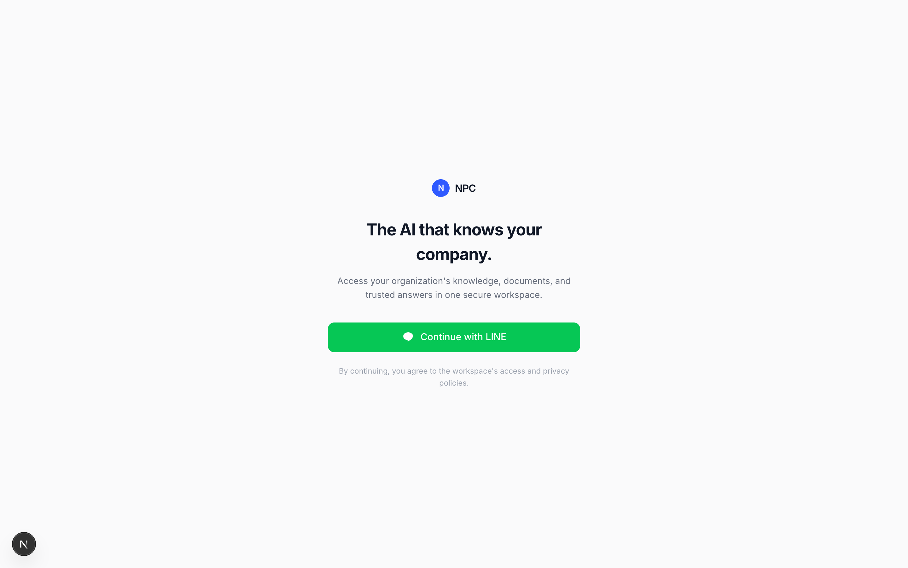
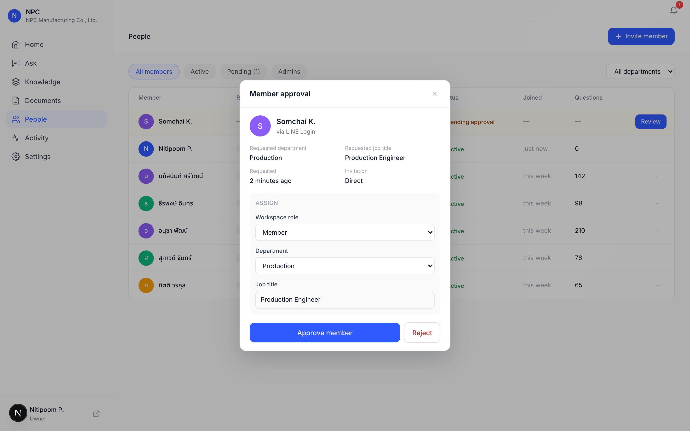
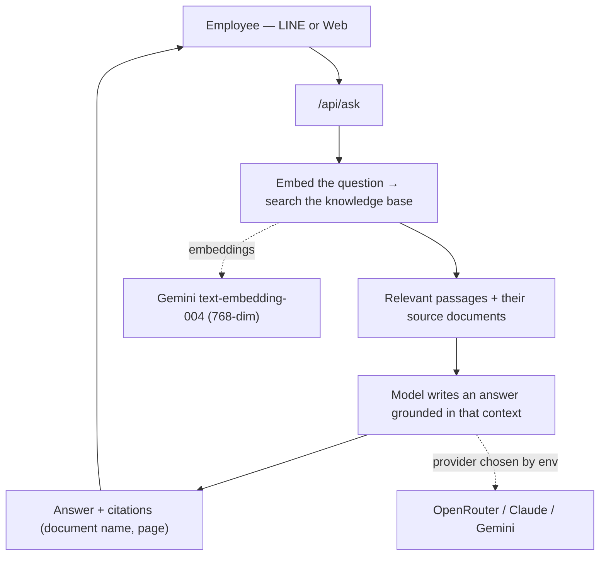

<h1 align="center">NPC</h1>

<p align="center"><b><i>Knowledge, not just chat.</i></b></p>

<p align="center">
  An enterprise knowledge workspace. It turns a company's documents into trusted, searchable
  <br/>knowledge — people ask a question and get an answer with citations they can verify.
</p>

<p align="center">
  
  
  
  
  
</p>

---

NPC is not a chatbot. It's a workspace for organizational knowledge: documents live in collections, every
answer is grounded in those documents and cites them by name and page, and if the answer isn't in the
knowledge base it says so instead of guessing.

I built it to work through a real enterprise RAG product end to end — retrieval, grounding, verifiable
citations, a document workspace, and a clean interface that feels like software people would actually use at
work. The repo ships with a made-up company ("NPC Co., Ltd.") and sample documents, so it runs out of the box.

## Screenshots

|  |  |
|---|---|
|  |  |
|  |  |

Each page has a distinct job — **Home** (what's happening in my workspace), **Ask** (what do I want to know),
**Knowledge** (what does my company know), **Documents** (what files are stored), plus People, Activity, and Settings.

## What it does

- **Ask, and get grounded answers.** Questions are answered from the company's documents, and every answer
  shows its sources with document name and page number in a dedicated citations panel.
- **Says "not found" instead of guessing.** If nothing relevant is retrieved, NPC declines rather than inventing an answer.
- **Knowledge Collections.** Documents are organized into collections (HR, Production, Safety, Engineering,
  Finance) so answers stay accurate and easy to govern.
- **A real document workspace.** Home dashboard, an enterprise documents table with indexing status, people,
  and an activity feed — not just a chat box.
- **Works on LINE too.** The same grounded answers are available through a LINE bot.
- **Any model.** The answer model is pluggable — OpenRouter (any model), Claude, or Gemini — chosen by which key you set.

## Organization & access

Sign-in is **LINE Login only**. A new user either creates an organization (becoming its
Owner) or opens an invitation link and requests to join. Owners and Admins generate secure,
expiring invite links, share them over LINE, and approve requests from a notification bell —
assigning role, department, and job title on approval. Roles are Owner / Admin / Member.

| Login | Member approval |
|---|---|
|  |  |

The onboarding flow (login, create org, invitations, join requests, approvals, notifications,
member management) is implemented in the UI. The database schema
([`supabase-auth-schema.sql`](supabase-auth-schema.sql)) and the LINE integration, API, and
security model ([`docs/AUTH.md`](docs/AUTH.md)) are documented for wiring the real backend.

## How it works



The model is told to answer only from the retrieved context and to return a `NOT_FOUND` marker when the answer
isn't there, which the app turns into a plain "not in the knowledge base" message. Documents are embedded with
Gemini and stored in Supabase (`pgvector`); similarity search runs as a SQL function.

There's also a fallback for quick starts: if Supabase and Gemini aren't configured, it reads the local markdown
files directly and ranks them by lexical overlap — so the whole thing runs with a single chat API key, no
database required, while the vector path is there for real document sets.

## Model providers

The answer provider is picked automatically from whichever key is present (override with `LLM_PROVIDER`):

1. `OPENROUTER_API_KEY` — OpenRouter, any model via `OPENROUTER_MODEL`
   (e.g. `anthropic/claude-sonnet-5`, `openai/gpt-4o`, `google/gemini-2.0-flash-001`)
2. `ANTHROPIC_API_KEY` — Claude directly
3. `GEMINI_API_KEY` — Gemini

Embeddings always use Gemini (OpenRouter has no embeddings endpoint), so a free `GEMINI_API_KEY` is only needed
for the full vector-search path. The no-database fallback needs just one chat key.

## Tech stack

| Layer | Choice |
|---|---|
| Framework | Next.js 16 (App Router, Turbopack), React 19, TypeScript |
| Vector DB | Supabase + `pgvector` (cosine similarity via a SQL function) |
| Embeddings | Gemini `text-embedding-004` (768-dim) |
| Answer model | OpenRouter / Claude / Gemini (pluggable) |
| Messaging | LINE Messaging API (`@line/bot-sdk`) |
| Design | Tailwind CSS v4, Inter + Noto Sans Thai, outline icons |

## Running it

```bash
npm install
cp .env.local.example .env.local   # add at least one chat key, e.g. OPENROUTER_API_KEY
npm run dev                         # http://localhost:3000
```

That's enough to try the Ask page and the no-database fallback.

For the full vector search (worth it once you have more than a few documents):

1. Create a [Supabase](https://supabase.com) project and run [`supabase-schema.sql`](supabase-schema.sql) in the SQL editor.
2. Add `NEXT_PUBLIC_SUPABASE_URL`, `SUPABASE_SERVICE_ROLE_KEY`, and a `GEMINI_API_KEY` to `.env.local`.
3. Ingest the documents: `npm run ingest`.

To connect LINE, deploy (Vercel works well) and point the webhook to `https://<your-app>/api/webhook`.

## Project layout

```
data/npc-corp/          Knowledge base (fictional NPC Co., Ltd. documents)
data/uploads/           Files uploaded at runtime (git-ignored)
scripts/ingest.ts       Chunk, embed, and upsert into Supabase
src/lib/rag.ts          Retrieve, ground, answer with citations (plus the no-DB fallback)
src/lib/llm.ts          Provider abstraction (OpenRouter / Claude / Gemini)
src/lib/embeddings.ts   Gemini embeddings
src/components/          Sidebar, icons
src/app/                 Home, Ask, Knowledge, Documents, People, Activity, Settings
src/app/api/            ask, upload, webhook (LINE)
supabase-schema.sql     pgvector schema and similarity function
```

## Notes

- The documents in `data/npc-corp/` are entirely made up, so nothing sensitive is in this repo.
- `.env.local` is git-ignored — keep your keys out of version control, and set a spend limit on paid providers.

## What's next

- PDF and Word ingestion (currently plain text and markdown)
- SSO and per-collection access control
- Streaming responses
- A dashboard over the query log to surface questions that go unanswered
