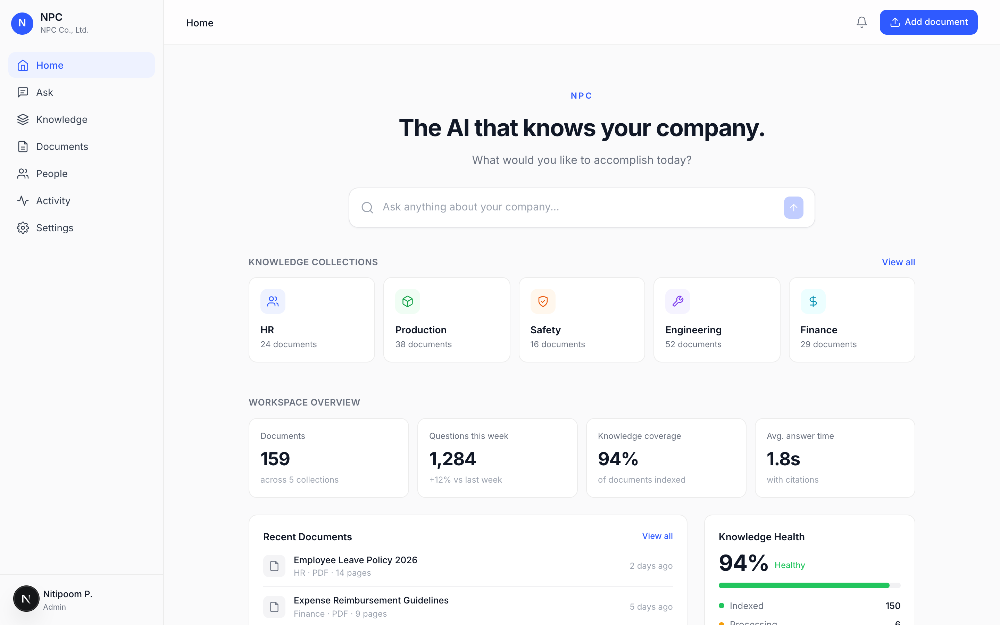
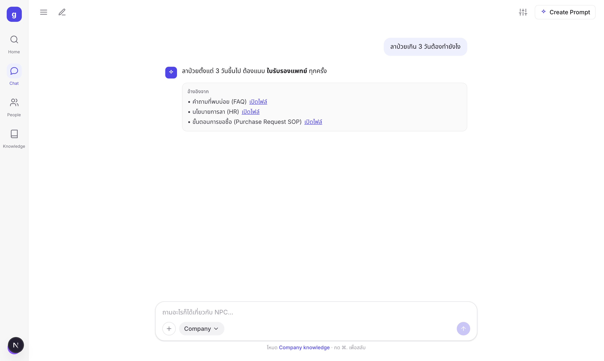
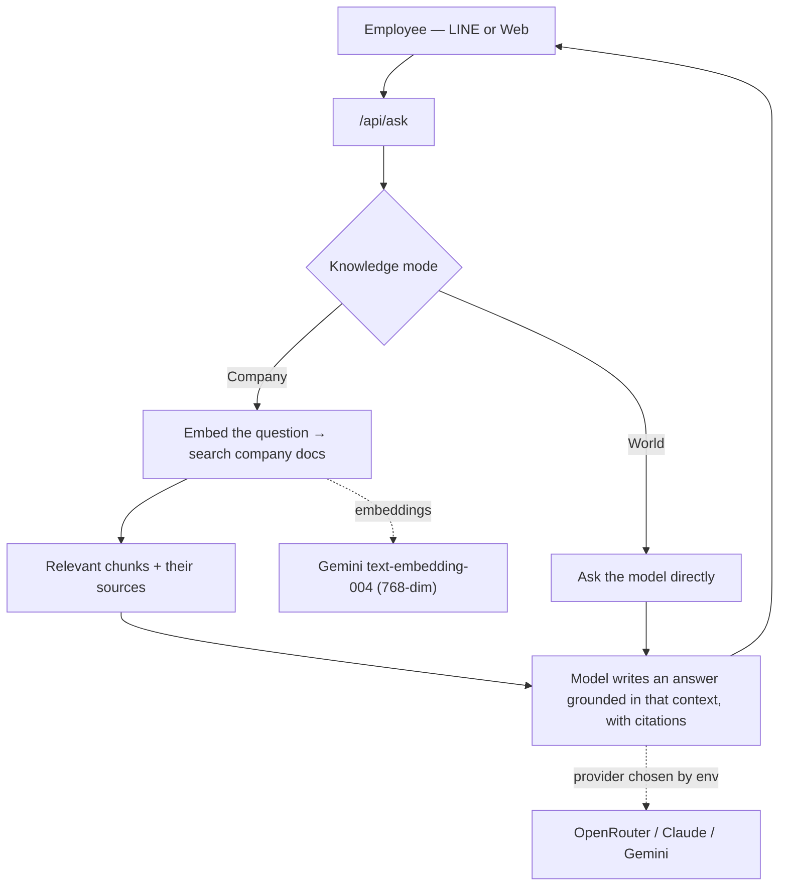

<h1 align="center">NPC Brain</h1>

<p align="center">
  An internal knowledge assistant. Employees ask a question — on LINE or in the web app —
  <br/>and it answers from the company's own documents, with a link back to the source.
</p>

<p align="center">
  
  
  
  
  
</p>

---

Most company chatbots either don't know your internal stuff or make it up. NPC Brain does neither: it only
answers from documents you give it, always shows where the answer came from, and replies "not found" when the
answer isn't in the docs.

I built it to work through a practical RAG setup end to end — retrieval, grounding, citations, a LINE
integration, and a chat UI that doesn't feel like a demo. The repo ships with a made-up company
("NPC Co., Ltd.") and a handful of sample HR, finance, IT, and SOP documents, so it runs out of the box.

## Screenshots

| Home | A grounded answer |
|---|---|
|  |  |

## What it does

- **Answers from company docs.** Ask about leave policy, expense limits, where a template lives, an SOP, or a
  customer project, and get a short answer with the source document linked.
- **Says "not found" instead of guessing.** If retrieval turns up nothing relevant, it won't invent an answer.
- **Two modes.** *Company knowledge* searches your documents; *World knowledge* is a plain assistant for general
  writing and research. Toggle with a click or `Cmd+.`.
- **Upload to teach it.** Drop a text file into the chat and it becomes part of the knowledge base immediately.
- **Works on LINE.** The same answers are available through a LINE bot, so people can ask from where they already chat.
- **Any model.** The chat provider is pluggable — OpenRouter (any model), Claude, or Gemini — chosen by which key you set.

## How it works



The model is told to answer only from the retrieved context and to return a `NOT_FOUND` marker when the answer
isn't there, which the app turns into a plain "not in the system" message. Documents are embedded with Gemini
and stored in Supabase (`pgvector`); similarity search runs as a SQL function.

There's also a fallback for quick starts: if Supabase and Gemini aren't configured, Company mode reads the local
markdown files directly and ranks them by lexical overlap. That means the whole thing runs with a single chat
API key, no database required — handy for a demo, while the vector path is there for real document sets.

## Model providers

The chat provider is picked automatically from whichever key is present (override with `LLM_PROVIDER`):

1. `OPENROUTER_API_KEY` — OpenRouter, any model via `OPENROUTER_MODEL`
   (e.g. `anthropic/claude-sonnet-5`, `openai/gpt-4o`, `google/gemini-2.0-flash-001`)
2. `ANTHROPIC_API_KEY` — Claude directly
3. `GEMINI_API_KEY` — Gemini

Embeddings always use Gemini (OpenRouter has no embeddings endpoint), so a free `GEMINI_API_KEY` is only needed
for the full vector-search path. The no-database fallback needs just one chat key.

## Tech stack

| Layer | Choice |
|---|---|
| Framework | Next.js 16 (App Router, Turbopack), React 19, TypeScript |
| Vector DB | Supabase + `pgvector` (cosine similarity via a SQL function) |
| Embeddings | Gemini `text-embedding-004` (768-dim) |
| Answer model | OpenRouter / Claude / Gemini (pluggable) |
| Messaging | LINE Messaging API (`@line/bot-sdk`) |
| Styling | Tailwind CSS v4, Inter + Noto Sans Thai |

## Running it

```bash
npm install
cp .env.local.example .env.local   # add at least one chat key, e.g. OPENROUTER_API_KEY
npm run dev                         # http://localhost:3000
```

That's enough to use World knowledge and the no-database Company knowledge fallback.

For the full vector search (worth it once you have more than a few documents):

1. Create a [Supabase](https://supabase.com) project and run [`supabase-schema.sql`](supabase-schema.sql) in the SQL editor.
2. Add `NEXT_PUBLIC_SUPABASE_URL`, `SUPABASE_SERVICE_ROLE_KEY`, and a `GEMINI_API_KEY` to `.env.local`.
3. Ingest the documents: `npm run ingest`.

To connect LINE, deploy (Vercel works well) and point the webhook to `https://<your-app>/api/webhook` in the
LINE Developers Console.

## Project layout

```
data/npc-corp/          Knowledge base (fictional NPC Co., Ltd. documents)
data/uploads/           Files uploaded at runtime (git-ignored)
scripts/ingest.ts       Chunk, embed, and upsert into Supabase
src/lib/embeddings.ts   Gemini embeddings
src/lib/llm.ts          Provider abstraction (OpenRouter / Claude / Gemini)
src/lib/rag.ts          Retrieve, ground, answer with citations (plus the no-DB fallback)
src/app/api/webhook/    LINE webhook
src/app/api/ask/        Web endpoint (company | world)
src/app/api/upload/     File upload
src/app/page.tsx        Chat UI
supabase-schema.sql     pgvector schema and similarity function
```

## Notes

- The documents in `data/npc-corp/` are entirely made up, so nothing sensitive is in this repo.
- `.env.local` is git-ignored — keep your keys out of version control, and set a spend limit on paid providers.

## What's next

- PDF and Word upload (currently plain text)
- Streaming responses
- Per-department access control
- A small dashboard over the query log to surface the questions that go unanswered
