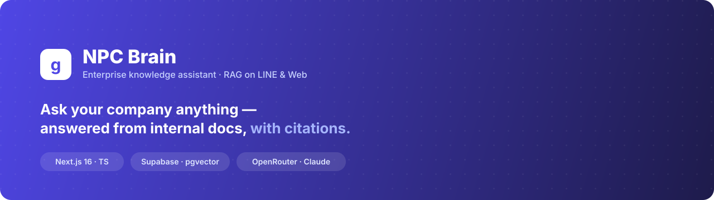
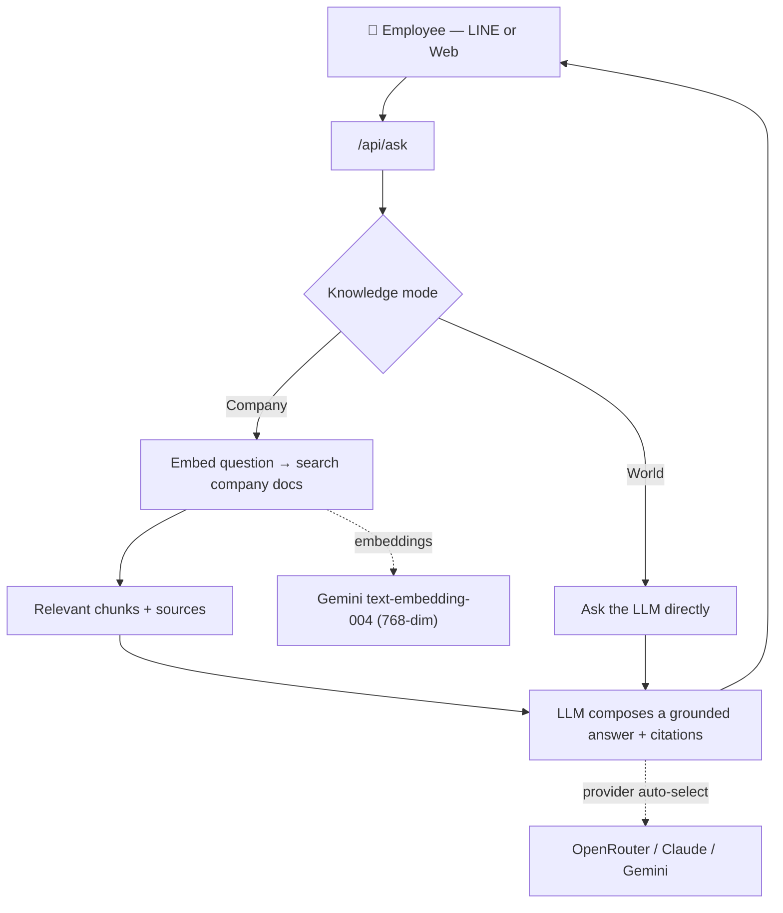

<p align="center">
  
</p>

<h1 align="center">NPC Brain 🧠</h1>

<p align="center">
  An internal <b>knowledge assistant</b> that answers employees' questions — on <b>LINE</b> or the web —
  <br/>grounded in the company's own documents, always <b>with source citations</b>.
</p>

<p align="center">
  
  
  
  
  
</p>

---

Unlike a generic chatbot, NPC Brain answers **only from your company's data** and says *"not found"* instead of
making things up. Employees can ask about HR policy, expense rules, where a file lives, an SOP, or a customer
project — and get a concise answer with a link back to the source document.

> 🧪 This repo ships with a **fictional company** (“NPC Co., Ltd.”) and sample HR / finance / IT / SOP / customer
> docs so the whole thing runs end-to-end out of the box.

## ✨ Why this project is interesting

- **RAG done right** — retrieval + grounding + **citations**, with an explicit *"I don't know"* path (no hallucination).
- **Multi-provider LLM** — one abstraction over **OpenRouter, Claude, and Gemini**; switch models with an env var.
- **Graceful degradation** — if the vector DB isn't configured, Company mode **falls back to reading local docs
  directly**, so the demo runs with a *single* API key.
- **Upload & remember** — drop a text file in chat and it's instantly part of the knowledge base.
- **Full-stack + integrations** — Next.js App Router, Supabase `pgvector`, and a LINE Messaging API webhook.
- **Product-grade UI** — a clean, Glean-inspired chat with a Company/World knowledge toggle.

## 📸 Screenshots

<details>
  <summary>▶ Web playground (click to expand)</summary>
  <br/>
  
  
  <p><i>Left: prompt library &amp; chat. Right: an answer grounded in company docs, with clickable citations.</i></p>
</details>

> Add your own captures to [`docs/screenshots/`](docs/screenshots/) using the filenames above and this section renders automatically.

## 🧩 Features

| Feature | What it does |
|---|---|
| **Company knowledge (RAG)** | Embeds the question, searches company docs, answers **only** from what it finds |
| **World knowledge** | Toggles to a plain LLM for general writing/research (no retrieval) — `⌘.` to switch |
| **Citations & anti-hallucination** | Every answer links its source docs; returns *"not found"* when the answer isn't in the corpus |
| **Upload & remember** | `+` in the chat uploads a text file → stored and merged into Company knowledge instantly |
| **LINE bot** | Employees ask from LINE; webhook validates signatures and replies with the same RAG answer |
| **Multi-provider LLM** | Auto-selects **OpenRouter → Claude → Gemini** by which key is set; model configurable |
| **No-DB fallback** | Without Supabase/Gemini, reads local markdown directly (lexical ranking) — runs on one key |
| **Query logging** | Logs questions, answered/not, sources & latency (great for spotting knowledge gaps) |

## 🏗 How it works



**Grounding rule:** the model is instructed to answer strictly from the retrieved context and to return a
`NOT_FOUND` sentinel when the docs don't contain the answer — which the app renders as a friendly
"not in the system" message instead of a guess.

## 🛠 Tech stack

| Layer | Choice |
|---|---|
| Framework | **Next.js 16** (App Router, Turbopack), React 19, TypeScript |
| Vector DB | **Supabase** + `pgvector` (cosine similarity via SQL function) |
| Embeddings | **Gemini** `text-embedding-004` (free tier, 768-dim) |
| Answer LLM | **OpenRouter** (any model) · **Claude** · **Gemini** — pluggable |
| Messaging | **LINE Messaging API** (`@line/bot-sdk`) |
| Styling | Tailwind CSS v4, Inter + Noto Sans Thai |

## 🔌 Model providers

Chat provider is chosen automatically by which key is present (override with `LLM_PROVIDER`):

1. `OPENROUTER_API_KEY` → **OpenRouter** — one key, any model via `OPENROUTER_MODEL`
   (e.g. `anthropic/claude-sonnet-5`, `openai/gpt-4o`, `google/gemini-2.0-flash-001`)
2. `ANTHROPIC_API_KEY` → **Claude** directly
3. `GEMINI_API_KEY` → **Gemini**

> Embeddings always use Gemini (OpenRouter has no embeddings API), so a free `GEMINI_API_KEY` is needed only
> for the **full** vector-search path. The **no-DB fallback** needs none of it — just one chat key.

## 🚀 Getting started

```bash
npm install
cp .env.local.example .env.local   # add at least one chat key (e.g. OPENROUTER_API_KEY)
npm run dev                         # http://localhost:3000
```

That's enough to try **World knowledge** and the **no-DB Company knowledge** fallback.

**For full vector RAG** (recommended for large doc sets):

1. Create a [Supabase](https://supabase.com) project and run [`supabase-schema.sql`](supabase-schema.sql) in the SQL editor.
2. Add `NEXT_PUBLIC_SUPABASE_URL`, `SUPABASE_SERVICE_ROLE_KEY`, and a free `GEMINI_API_KEY` to `.env.local`.
3. Ingest the docs:
   ```bash
   npm run ingest
   ```

**Connect LINE:** deploy (e.g. Vercel), then set the webhook URL to
`https://<your-app>/api/webhook` in the LINE Developers Console.

## 📂 Project structure

```
data/npc-corp/          Knowledge base (fictional NPC Co., Ltd. docs)
data/uploads/           Files uploaded at runtime (git-ignored)
scripts/ingest.ts       Chunk + embed + upsert into Supabase
src/lib/embeddings.ts   Gemini embeddings (768-dim)
src/lib/llm.ts          Provider abstraction (OpenRouter / Claude / Gemini)
src/lib/rag.ts          RAG core: retrieve → ground → answer + citations (+ no-DB fallback)
src/app/api/webhook/    LINE webhook
src/app/api/ask/        REST endpoint for the web playground (company | world)
src/app/api/upload/     File upload → "remember"
src/app/page.tsx        Glean-style chat UI
supabase-schema.sql     pgvector schema + similarity function
```

## 🗺 Roadmap

- [ ] PDF / Word upload (currently text files only)
- [ ] Streaming responses (token-by-token)
- [ ] Access control by department (e.g. customer data limited to sales)
- [ ] Admin dashboard over `query_logs` (top questions, unanswered = knowledge gaps)
- [ ] LIFF page for richer LINE onboarding

## 🔒 Notes

- Company data in `data/npc-corp/` is **entirely fictional** — safe to publish.
- **Never commit `.env.local`** (it's git-ignored). Rotate any key that has been shared, and set a spend limit.

---

<p align="center"><sub>Built with Next.js · Supabase · OpenRouter — a Thai-first internal AI assistant.</sub></p>
